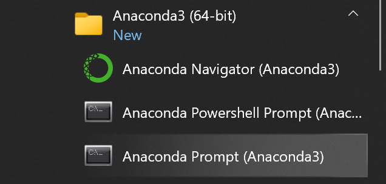
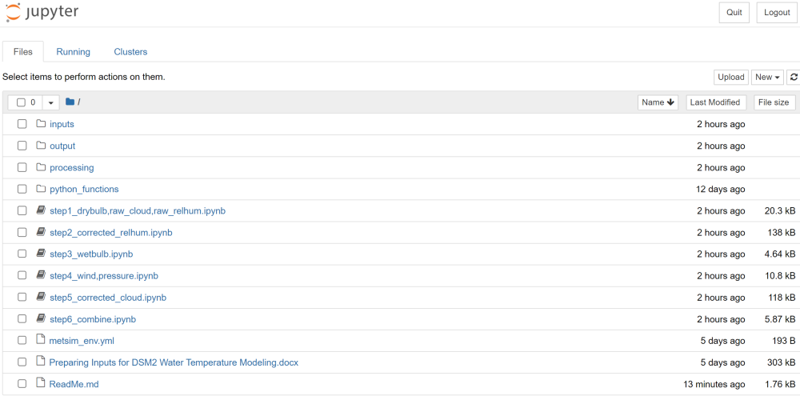
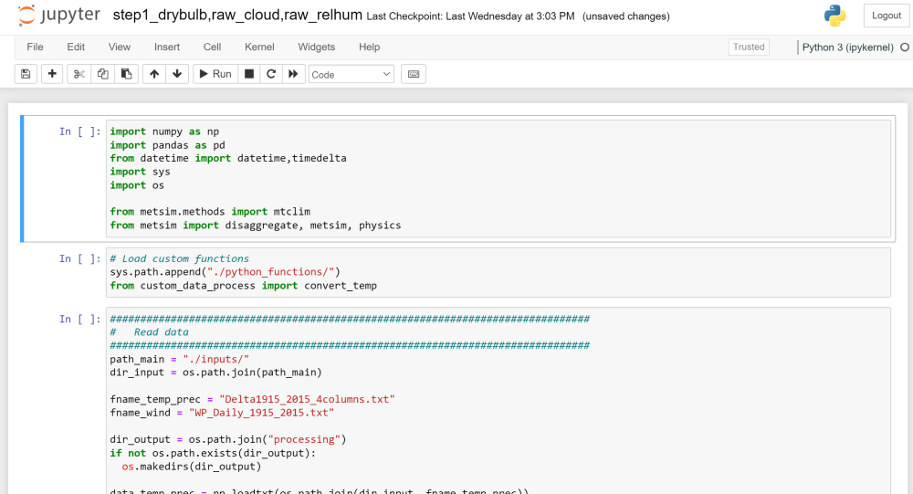

# Preparing Inputs for DSM2 Water Temperature Modeling

## Introduction

This document provides instruction for preparing the inputs for DSM2 water temperature modeling. 

While some inputs were generated using MetSim, a meteorology simulator (https://metsim.readthedocs.io/en/develop/), data from other sources (provided by outside consultants) have been utilized as well.

Preparing the inputs involves running several Python scripts in sequence. This document provides instruction on how to set up the computing environment to run the scripts. The scripts have been organized such that no modifications are necessary; simply run them in the correct order and the final product will be generated.

It should be noted that, in preparing this package, the intention was to re-create the official time series that was adopted for DSM2 water temperature modeling. To match the previously reported values, output precisions were limited to two or three decimal places. It is up to the user to modify the scripts as necessary to ensure desired precision.

## Python Environment

The scripts are in the form of Jupyter Notebook files (.ipynb), and a correct python environment must be set up to run them. They can also be run on Google Colab after some code modifications but it is beyond the scope of this document.

### Installing Python

It is recommended to obtain Python from Anaconda, a distribution package of Python for scientific computing. Download Anaconda from https://www.anaconda.com/products/individual and install with default setup options. Once installation is complete, open Anaconda Prompt from the start menu:



### Installing and Activating Conda Environment
In the prompt window, navigate to the top directory of the package. Type in the following command to create a python environment:
```sh
conda env create -f metsim_env.yml
```
It may take several minutes. Once the process is complete, activate the newly created environment by typing in:

```sh
conda activate metsim_env
```
Now you are ready to run the scripts.

## Running Scripts

In the prompt window (with metsim_env activated), type in:
```sh
jupyter notebook
```
This command will open a browser that shows the folder structure:



Here, the “inputs” folder contains files required to run the scripts. The “python_functions” folder contains custom functions. The files with .ipynb extension are the scripts that need to be run. The file names indicate the order in which they must be run (i.e., run the script that begins with “step1_” first).

To run a script, click on the file name, which will open up a new window:



To run the script, go to [Cell] in the menu bar, then select “Run All”. When all six scripts have been run (in the correct order as indicated by the file name), a new folder named “output” will be generated. It will contain **Timeseries_All.csv**, which is the time series of all variables of interest.